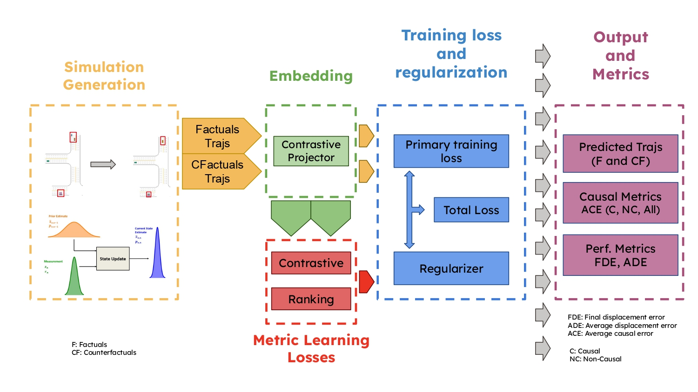

# Vehicle Causality Project: Causal Analysis for Autonomous Driving

## Overview

Developed at the [VITA Lab (Visual Intelligence for Transportation), EPFL](https://www.epfl.ch/labs/vita/), this project studies how autonomous driving policies react to causal interventions. We generate counterfactual simulations by selectively removing vehicles, train trajectory prediction models with causal regularization, and measure how interventions improve robustness under distribution shifts.

<p align="center">
  
</p>
<p align="center"><em>Causal Framework Overview</em></p>

## Key Contributions

- **Causal Analysis Framework:** Counterfactual scene generation isolates the influence of surrounding agents on the ego vehicle.
- **Causal Regularization:** Contrastive and ranking objectives encourage AutoBot to reason about interventions and maintain performance under OOD settings.
- **Automated Counterfactual Generation:** Large-scale procedural scenarios and intervention variants support systematic ablations at scale.

## Project Context

This work was carried out as part of a research collaboration with the [VITA Lab, EPFL](https://www.epfl.ch/labs/vita/), under the supervision of Prof. Alexandre Alahi. I developed the causal analysis pipeline, dataset generation scripts, and the experimental setup for training and evaluating AutoBot models under causal regularization.

### Research Report

The complete scientific report can be downloaded from [`docs/vehicle_causality_report.pdf`](docs/vehicle_causality_report.pdf). Please cite it alongside the repositories below when referencing this work.

## Installation and Setup

The project depends on customized forks of MetaDrive, ScenarioNet, and UniTraj. A complete environment walkthrough, including the Conda setup and editable installs, is available in `docs/installation.md`.

## Datasets

Synthetic, real-world (nuScenes), and two OOD benchmarks power the evaluation suite. Detailed paths, dataset statistics, and UniTraj field descriptions are documented in `docs/dataset_structure.md`.

## Running Experiments

Training, evaluation, baseline configurations, and data-merging utilities are summarized in `docs/training_instructions.md`. Update the UniTraj configs, toggle the desired causal regularizer, and run `python train.py method=autobot` to reproduce the experiments.

## Baseline Experiments

We trained AutoBot on three configurations:

| Model | Brier FDE ↓ | minADE6 ↓ | minFDE6 ↓ | Miss Rate ↓ |
|-------|------------|-----------|-----------|-------------|
| **AutoBot on NuScenes** | 2.41 | 0.8727 | 1.81 | 0.30 |
| **AutoBot on Synthetic** | **1.56** | **0.53** | **0.93** | **0.14** |
| **AutoBot on Merged Data** | 2.57 | 0.54 | 1.91 | 0.31 |

### Key Insights

**Synthetic Data is Learnable:**  
The model trained on the synthetic dataset alone achieved **best accuracy**, confirming its suitability for trajectory prediction.  

**Combining Real and Synthetic Data Does Not Help:**  
The merged dataset **decreased performance**, suggesting domain differences between synthetic and real data hinder learning.  

**Training on Real Data is More Challenging:**  
The **NuScenes**-trained model had **higher prediction errors**, reflecting the increased complexity of real-world data.  


## Training with Causal Regularization

We applied **contrastive loss** and **ranking loss** to improve generalization.  
The best regularization strength **λ** was determined via **grid search**.

| Model | ACE ALL ↓ | ACE DC ↓ | ACE NC ↓ | Brier FDE ↓ | minADE6 ↓ | minFDE6 ↓ | Miss Rate ↓ |
|-------|----------|----------|----------|------------|-----------|-----------|-------------|
| Contrastive **λ = 1000** | 202.1 | 665.33 | 18.5 | 1.39 | 0.578 | 0.716 | 0.047 |
| Ranking **λ = 1000** | 201.13 | 661.6 | 17.76 | 1.41 | 0.580 | 0.726 | 0.049 |
| Contrastive **λ = 100** | 203.6 | 664.61 | 19.89 | 1.40 | 0.570 | 0.713 | 0.046 |
| Ranking **λ = 100** | 202.68 | 662.58 | 18.85 | 1.39 | 0.569 | 0.715 | 0.046 |
| **No Regularization** | **203.73** | **664.9** | **19.06** | **1.35** | **0.55** | **0.672** | **0.041** |

### Key Takeaways

- **Regularization slightly improved ACE metrics** but increased error on in-distribution data.  
- **Regularized models focused more on causal relationships**, leading to **better OOD generalization**.  


## Out-of-Distribution (OOD) Generalization

We evaluated the models under **higher traffic density** and **policy shifts**.

### OOD - Increased Traffic Density

| Model | ACE ALL ↓ | ACE DC ↓ | ACE NC ↓ | Brier FDE ↓ | minADE6 ↓ | minFDE6 ↓ | Miss Rate ↓ |
|-------|----------|----------|----------|------------|-----------|-----------|-------------|
| Ranking **λ = 1000** | 103.43 | 653.02 | 13.17 | 4.62 | 2.31 | 3.86 | 0.41 |
| Contrastive **λ = 100** | 101.19 | 654.4 | 11.46 | 4.88 | 2.5 | 4.13 | 0.43 |

### OOD - Policy Shift (IDM instead of Expert Policy)

| Model | ACE ALL ↓ | ACE DC ↓ | ACE NC ↓ | Brier FDE ↓ | minADE6 ↓ | minFDE6 ↓ | Miss Rate ↓ |
|-------|----------|----------|----------|------------|-----------|-----------|-------------|
| Ranking **λ = 1000** | 111.55 | 667.76 | 11.69 | 5.17 | 2.61 | 4.43 | 0.466 |
| Contrastive **λ = 1000** | 110.4 | 667.22 | 12.66 | 5.36 | 2.7 | 4.61 | 0.468 |

### Key Observations

**Regularization Improves OOD Performance:**  
Models trained with **causal loss** exhibited **better ACE scores** in high-density and policy-shift scenarios.  

**Ranking Loss > Contrastive Loss:**  
Ranking loss models had **lower ACE OVERALL and ACE NC**, showing **stronger causal awareness**.  

**No Regularization = Higher Errors:**  
Baseline AutoBot had **higher miss rates and worse FDE scores**, confirming that **causal constraints improve OOD generalization**.  

## Future Work

Moving forward, **sim2real adaptation** should be integrated to improve **real-world transferability**.
The code should also be optimized. The next step is to extend causal evaluation to real-world datasets and integrate visual inputs into the simulation-to-reality pipeline.

# Citation

If you use this repository in your research, please cite **ScenarioNet**, **MetaDrive** and **UniTraj**:

```
@article{li2023scenarionet,
  title={ScenarioNet: Open-Source Platform for Large-Scale Traffic Scenario Simulation and Modeling},
  author={Li, Quanyi et al.},
  journal={Advances in Neural Information Processing Systems},
  year={2023}
}
@article{li2022metadrive,
  title={MetaDrive: Composing Diverse Driving Scenarios for RL},
  author={Li, Quanyi et al.},
  journal={IEEE Transactions on Pattern Analysis and Machine Intelligence},
  year={2022}
}
@article{feng2024unitraj,
  title={UniTraj: A Unified Framework for Scalable Vehicle Trajectory Prediction},
  author={Feng, Lan and Bahari, Mohammadhossein and Amor, Kaouther Messaoud Ben and Zablocki, {\'E}loi and Cord, Matthieu and Alahi, Alexandre},
  journal={arXiv preprint arXiv:2403.15098},
  year={2024}
}
```
